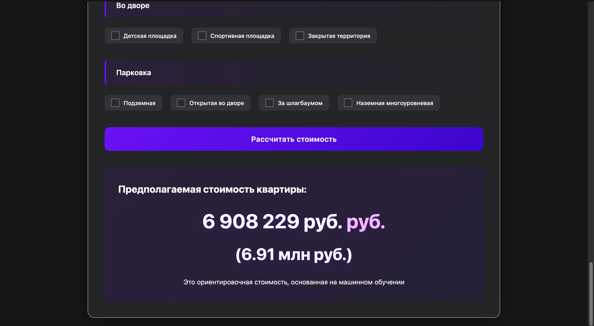
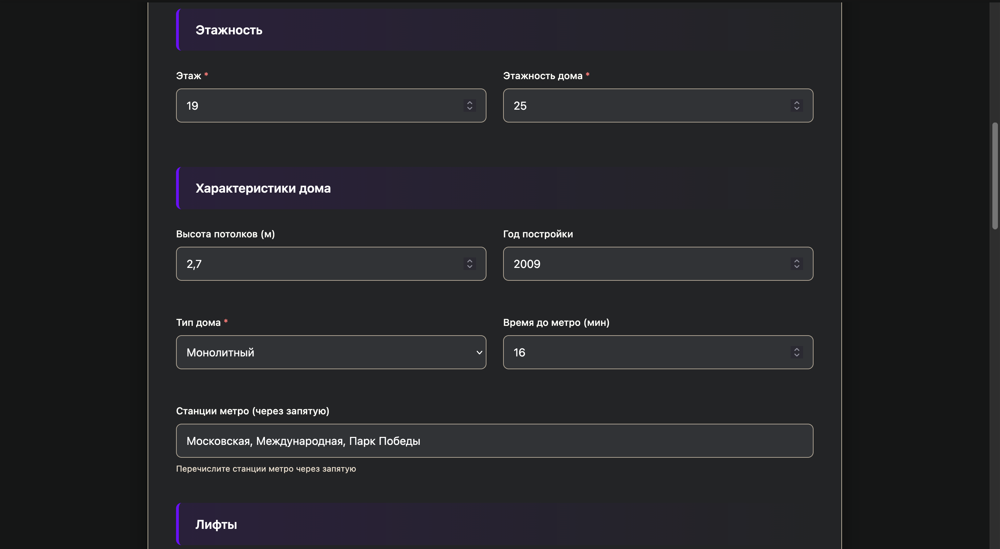
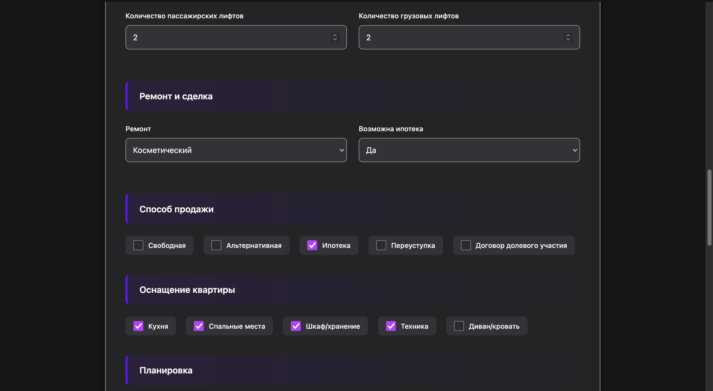

# Прогнозирование цен на недвижимость Avito

Проект машинного обучения для предсказания цен на квартиры в Санкт-Петербурге на основе данных с Avito. Включает парсинг данных, feature engineering, модель CatBoost, REST API на FastAPI и веб-интерфейс с готовой Docker-инфраструктурой для развертывания.

## Особенности проекта

- **Парсинг данных**: Сбор ~15,000 объявлений с Avito
- **Feature Engineering**: 50+ признаков включая геоданные, характеристики квартир и инфраструктуру
- **Модель**: CatBoostRegressor с оптимизацией гиперпараметров
- **Веб-интерфейс**: Интуитивный UI для предсказания цен
- **REST API**: Документированное API для интеграций
- **Docker**: Полностью контейнеризированное решение

## Быстрый старт

### Предварительные требования

#### 1. Установите Docker
- **Windows/Mac**: Скачайте и установите [Docker Desktop](https://www.docker.com/products/docker-desktop/)
- **Linux**: Выполните в терминале:
  ```bash
  sudo apt-get update
  sudo apt-get install docker.io docker-compose
  ```

#### 2. Проверьте установку
```bash
docker --version
docker-compose --version
```

### Установка и запуск

#### 1. Клонируйте репозиторий:
```bash
git clone https://github.com/ваш-username/avito-flats-ml-project
cd avito-flats-ml-project
```

#### 2. Запустите приложение:
```bash
docker-compose up
```

После запуска:
- **API сервер**: `http://localhost:8000`
- **Swagger UI документация**: `http://localhost:8000/docs`
- **Веб-интерфейс**: `http://localhost:8000`

## Веб-интерфейс






## Возможности

### Основные функции
- **Прогнозирование цены**: Примерная оценка стоимости квартиры в рублях
- **Геоанализ**: Учёт расположения относительно метро и инфраструктуры

### Технические особенности
- **Продвинутый препроцессинг**: Обработка пропусков, выбросов, feature engineering
- **Оптимизация модели**: GridSearchCV для подбора гиперпараметров

## Использование API

### 1. Прогнозирование цены одной квартиры

**POST запрос к `/predict`:**
```bash
```bash
curl -X 'POST' \
  'http://localhost:8000/api/predict' \
  -H 'Content-Type: application/json' \
  -d '{
    "комнат": 2.0,
    "площадь_общая": 65.0,
    "площадь_кухни": 12.0,
    "площадь_жилая": 40.0,
    "этаж": 5,
    "этажность_дома": 16,
    "высота_потолков": 2.7,
    "год_постройки": 2010,
    "тип_дома": "панельный",
    "время_до_ближайшего_мин": 15.0,
    "все_метро": "Академическая, Профсоюзная",
    "лифт_пасс": 1,
    "лифт_груз": 0,
    "ремонт": "евро",
    "вид_сделки": 1,
    "is_apartment": 0,
    "студия": 0
  }'
```

**Ответ:**
```json
{
  "status":"success",
  "predicted_price":11235550.390916344,
  "predicted_price_formatted":"11 235 550 руб.",
  "predicted_price_millions":"11.24"
}
```

```

## Модель и алгоритмы

### Архитектура решения

```
Парсинг Avito → Предобработка → Feature Engineering → CatBoost → API/Web
```

### Этапы обработки данных

#### 1. Feature Extraction
- Извлечение параметров из сырых данных
- Метро, количество комнат, студия, апартраменты, вид сделки и тд..

#### 2. Feature Engineering
- **Отношения**: Доли площадей, цена за м²
- **Категоризация**: Тип дома, возраст, высотность
- **Временные признаки**: Время до метро, наличие инфраструктуры
- **Статистические**: Средняя цена по метро, частотные признаки

#### 3. Обработка пропусков
- Медианное заполнение по группам
- Использование отношений (кухня/общая площадь)
- Каскадное заполнение с приоритетами

#### 4. Моделирование
- **Алгоритм**: CatBoostRegressor
- **Целевая переменная**: Логарифм цены


### Метрики производительности

```
Тренировочная выборка:
- RMSE (%): 15%

Тестовая выборка:
- RMSE (%): 23%
```


## Docker развертывание

### Команды docker-compose

```bash
# Запуск в фоновом режиме
docker-compose up -d

# Просмотр логов
docker-compose logs -f app

# Остановка всех контейнеров
docker-compose down

# Пересборка с обновлением зависимостей
docker-compose up --build
```


## Технологический стек

- **Python 3.9+** - основной язык
- **CatBoost** - градиентный бустинг
- **FastAPI** - веб-фреймворк
- **Docker** - контейнеризация
- **Pandas/NumPy** - обработка данных
- **Scikit-learn** - метрики и утилиты
- **playwright** - парсинг


## Дорожная карта

### Запланированные улучшения
- [ ] Сбор большего количества данных
- [ ] Добавление нейросетевых моделей
- [ ] Реализация A/B тестирования моделей
- [ ] Система рекомендаций похожих квартир
- [ ] Прогнозирование динамики цен
